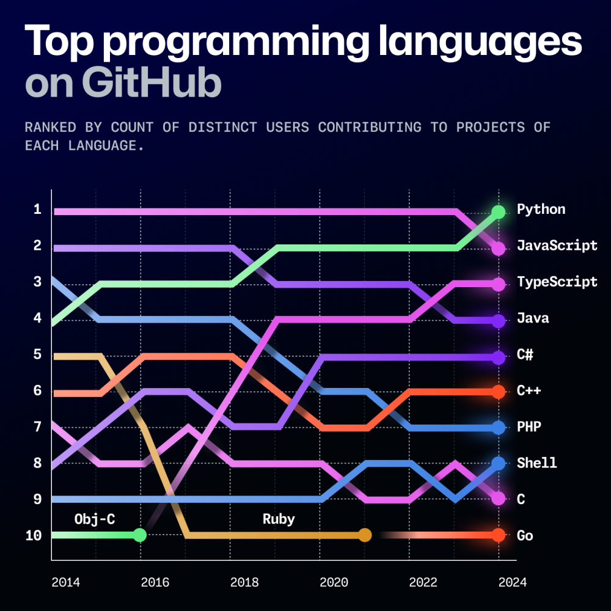
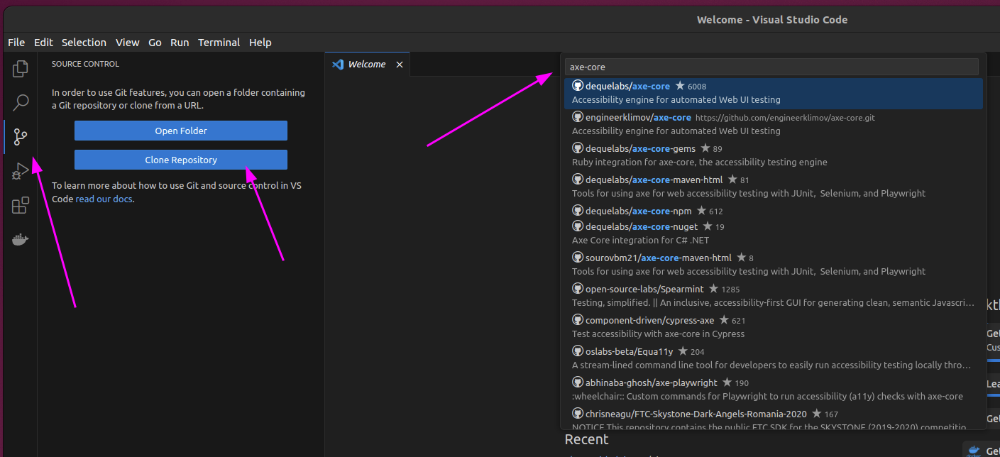
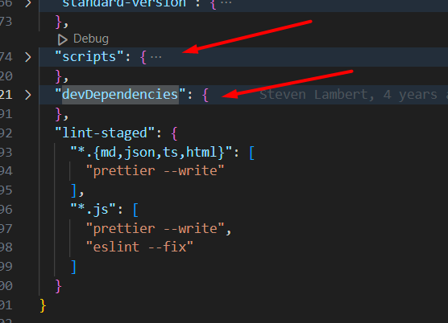
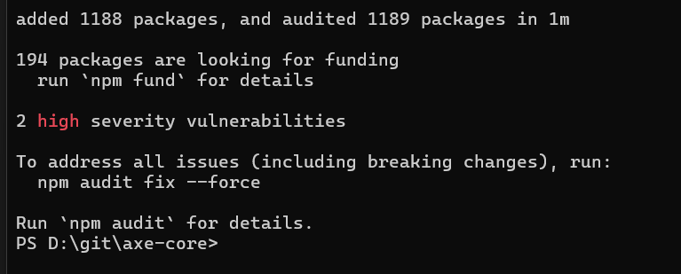
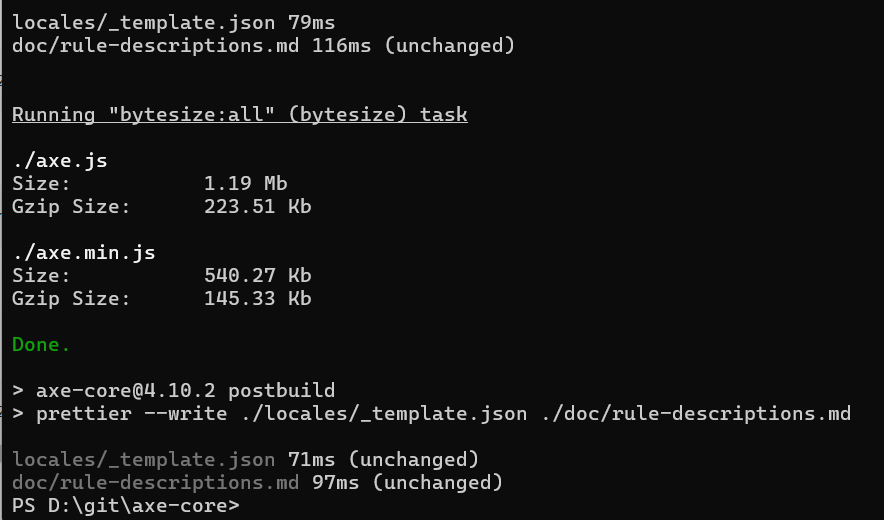

# Contribute to (OSS) Open source software
All of us using OSS, more over most of the software we use is based on oss. Routine process of development is picking packages from platform sources for example npm if you are developing java script program and writing some ligth glue code for that to make work your app. This is nature of software development because of one the base pricinples "DRY" - do not repeat yoursesf. Folloiwng that principle developers try to reuse every piece of code that is repeated. It is become hard to find this pieces because many developers already did that work. Also when piece of software is done by developer who realy love his work it is polished, and done with best efforts. With all that things in mind, it becomes really hard to put something valueable to public or contribute to project that is already used by many developers for person without years of developement experience or someone from IT but non developers like software testrs or designers. Another hand that pushed me to that direction is my colleges expertise, In conversations with a good friend of mine who is HR and one of the developers, who frequently conducts technical interviews I got some insight regarding how public work may transform interview process. From their experience OSS contribution is a rare, it will raise curiosity for sure. You may shift interview towards your area of expertise and leave a good impression even if you will be innacurate in your answers in required areas.

While this stair is high for beginner, such contributon may become a good starter for developer carier. It also looks very impressive in CV because all developers have some kind of pet projects but iusually they to shy to put it on public. Purpose of this guide is to help beginners to step on that stair.

## Choosing tech and project
From practical point of view it is alway better to stay with most popular technology because of larger communit there will be large amout of edge cases solved, bigger toolset and more documentatios, it is till humans writing code so more humans more code =). According to [github 2024 octoverse](https://github.blog/news-insights/octoverse/octoverse-2024/) Python beats JavaScript as most popular language. 

 

>-*There are three kinds of lies: lies, damned lies, and statistics.* — Mark Twain

>-*TypeScript (TS) is a superset of JavaScript (JS), developed and maintained by Microsoft as an open-source programming language.* — Google

So i would not say that JavaScript is beaten by Python. 

According logic described above my choise for oss contribution will be JavaScript and NodeJs as platform. My primary area of knowledje is Accesibility tools, Im also working as software tester. With this in mind best for me would be to contribute to some accessibility tool that is related to tesing and written in JavaScript. I know this tools a little so i will go directly to https://github.com/dequelabs/axe-core. You may find this logic too smooth to be true, especially since I’m not showing the research process. It's true that I already knew my target project before I started. However, I still recommend not blindly picking just any project. You need to carefully consider the learning curve; otherwise, it might kill your motivation.

## Tools and basics
For sure you have to learn basics to become a developer for this project it is: 
- Git         - *version control systems*
- JavaScript  - *programming language*
- NodeJs      - *JavaScript runtime*
- Npm         - *JavaScript package manager*
- VSCode      - *Integrated development environment*

You need to download and install this tools on your PC, follow official guides.

From my experience, the best way to learn something is to actually try using it. Some tools are quite straightforward — you don't need to spend hours figuring out how to chop a stick with an axe. A couple of hours of practice might be enough... maybe just a finger or two lost in the process! ;)

### Git
You need Git to commit your changes to the source code. Luckily, you don’t have to fully master it — just understanding the basic principles of version control systems is enough. Long story short, you’ll be editing text files alongside other people, and there are plenty of tools to sync your files in one place. Git is the de facto industry standard for this now. 

### VScode
Editing text in Notepad is deadly simple, but you have to use many other tools to make it smooth. Place where all these tools are aggregated is integrated development  environment. We need VScode to navigate and search in code, it has nice syntax highlighting and text formatting also we can avoid the git command line.

### JavaScript
You have to understand basics like variables, cycles, and functions. Btw you can use any code generation tools, like ChatGPT or analogs. Personally, I prefer Co-Pilot

### NPM and NodeJs
While developing software you need to use other developers code in your otherwise you will write everything from scratch each time you start a project. Easy way is to go to Git Hub and copypaste code from other repositories, how about code that other repositories uses itself? Нou need to climb a dependency tree until you reach very basics runtime platform code. There is tools for code sharing usually they are specific for platform or code in our Case it is NPM (Node Package Manager) is a default package manager that comes bundled with NodeJs. Each package manament comes with some hidden costs for example where is guarantee that somewhere in deep of dependency graph there is package that contains some malicios code? It is called supply chain attack.

 

## Discover choosen project

First of all you need a github account, this days is like facebook for developers, I already have it https://github.com/engineerklimov. I will create copy of [axe core](https://github.com/dequelabs/axe-core) in terms of git is called fork.

Lets donwload source code from mine axe core fork and try some basic operations. As i explained before you dont need to know all git command to use it probbaly you can event avoid its shell. Open vscode and navigate as shown in picture, in text field choose clone from github ot copypaste repository url.

 

### Restore packages and build project
Next step after you got axe core code locally is restore NPM packages. Installed packages and basic commands for project in NodeJs usually specified on package.json. As i explained before big dependency tree is a big bag to carry. I mentioned also opensource is best efforts software os axe core developers reduced their production dependencies to 0. If you look at manifest there is only `devDependencies`, external code that goes with your Js app located at `dependencies` which is missing here. That means maintainers implemented all functions down to browser code to make axe-core lib tiny. 

Lets try to build it. In VScode open project folder and open terminal if that is not open yet. Execute following commands
1. Restore dependencies `npm i`
2. Build project `npm run build`

After `npm i` you should see following output

Valid `npm run build` output

## Find contribution target

Where to look for? There is 3 sources: 

### Repository issues

This is worklog for project it also contais reported bugs and etc, usually issues marked with labels. It is better to check entire [list](https://github.com/dequelabs/axe-core/labels), I found `good first issue` and `help wanted` that may fit for my porposes. There is few on each label. I quickly checked them and found one that is pretty well descripted I had no idea what need to be done technically but atleast I undestood requirements. Maintainers pointed to files where this changes need to be done, this is already part of techical work since I have no idea about project structure. I decided to spent more time and look for something completely dumb to contribute, just to try.

### Past contributions from non maintainers

## Prepare pull request

## Maintainers review and merge
