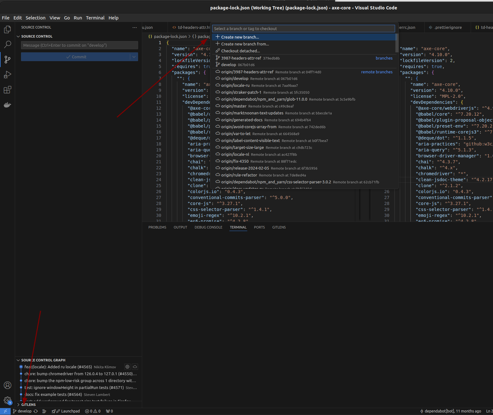

# Contribute to (OSS) Open Source Software

We all use OSS, and, more importantly, most of the software we rely on is built on OSS. A typical part of development involves picking packages from platform sources like npm if you're working on a JavaScript program, and adding some light glue code to make everything work together. This approach stems from one of the core principles of software development: **"DRY" — don’t repeat yourself**. Developers aim to reuse as much code as possible to avoid reinventing the wheel. 

However, because so many developers have already done this work, finding opportunities to contribute can feel like searching for a needle in a haystack. And when you do find a gap, it's often daunting to share your work in public, especially on projects already trusted and used by many.

This challenge is real, even for developers with several years of experience (middle or senior level), or experts from adjacent fields who have never contributed directly to OSS. But that shouldn’t stop you.

Another thing that pushed me to explore OSS contributions was insight from colleagues. A good friend of mine, who works in HR, and a developer who frequently conducts technical interviews, both emphasized how rare and impactful OSS contributions are. They told me that showcasing public work almost always sparks curiosity in interviews. It’s a great way to steer the conversation toward your strengths and make a lasting impression—even if you're less confident in other areas.

Contributing to OSS might feel like a steep climb, but it’s worth the effort. It not only enhances your resume but also gives you valuable experience. Many developers have pet projects, but few have the courage to put them in the spotlight. This guide will help you take that first step.

---

## Choosing a Technology and Project

From a practical perspective, it’s best to stick with popular technologies. Larger communities mean more solved edge cases, a wider range of tools, and better documentation. It’s still humans writing code, and more people means more shared knowledge. :)

According to [GitHub 2024 Octoverse](https://github.blog/news-insights/octoverse/octoverse-2024/), Python has surpassed JavaScript as the most popular language.


> *"There are three kinds of lies: lies, damned lies, and statistics."* — Mark Twain  
> *"TypeScript (TS) is a superset of JavaScript (JS), developed and maintained by Microsoft as an open-source programming language."* — Google  

TypeScript is essentially extended JavaScript—it’s like English text with commas. You can write without commas, and it will still be English text, just less structured.

Looking at the chart, JavaScript and TypeScript might seem like two separate entities, but they’re really two forms of the same language. Together, they dominate the ecosystem. So, I wouldn’t say Python has truly beaten JavaScript.

With this in mind, my choice for OSS contribution is JavaScript and NodeJs as a platform. My primary area of expertise is accessibility tools, and I’m also a software tester. Naturally, I decided to contribute to an accessibility tool related to testing, written in JavaScript. I already knew about [axe-core](https://github.com/dequelabs/axe-core), which made it an easy decision. 

You might think this reasoning is too smooth, especially since I’m skipping over the research phase. And you’re not wrong—I already had a target project in mind. That said, I still recommend carefully evaluating a project’s learning curve before committing. Otherwise, you might lose motivation halfway through.

---

## Tools and Basics

Before diving in, you’ll need to learn some basics. Here’s what you’ll need:
- **Git**: *Version control system*
- **JavaScript**: *Programming language*
- **NodeJs**: *JavaScript runtime*
- **Npm**: *JavaScript package manager*
- **VSCode**: *Integrated development environment*

Follow the official guides to download and install these tools on your PC.

From my experience, the best way to learn something is by doing. Some tools, like VSCode, are very intuitive. You won’t need hours of tutorials to figure out how to chop a stick with an axe—though you might lose a finger or two in the process. ;)

---

### Git

Git is essential for committing your changes to the source code. The good news is, you don’t need to become a Git master to contribute. Just understanding the basic principles of version control systems will be enough. Think of it as editing text files with a group of other people—Git helps you synchronize everyone’s work.

---

### VSCode

Notepad is fine for basic edits, but serious development requires more tools. VSCode is an integrated development environment that brings everything together. It makes navigating and searching through code easy and offers features like syntax highlighting and text formatting. Plus, you can avoid using the Git command line entirely.

---

### JavaScript

You should have a basic understanding of variables, loops, and functions. But don’t stress—there are plenty of tools to help you. Personally, I like using Co-Pilot for code suggestions.

---

### NPM and NodeJs

To avoid rewriting the same code over and over, developers rely on existing libraries. Tools like NPM (Node Package Manager) simplify sharing and reusing code. In our case, NPM comes bundled with NodeJs.

Think of it like climbing a tree of dependencies. At the top of the tree is your project, but beneath it lies a web of libraries and their own dependencies, each layer building on the one below. You keep climbing down until you reach the very foundation—the runtime platform code. This structure saves time and effort, letting you focus on higher-level logic instead of reinventing basic functionality.

However, this tree isn’t always safe. Somewhere deep in its roots, there could be a package with malicious code. This type of risk is called a supply chain attack, and it’s a challenge every developer should be mindful of.


---

## Discover Chosen Project

First of all, you need a GitHub account; these days, it’s like Facebook for developers. I already have one: [https://github.com/engineerklimov](https://github.com/engineerklimov). The next step is to create a copy of the project repository—this is called a "fork."

### Step 1: Fork and Clone the Repository

1. Open the project’s GitHub page (e.g., [axe-core](https://github.com/dequelabs/axe-core)).
2. Click the **Fork** button in the top-right corner. This creates a copy of the repository in your GitHub account.
3. Open VSCode and go to the **Source Control** tab.
4. Click **Clone Repository** and choose **Clone from GitHub** or paste the URL of your fork.
5. Select a local folder where the code will be saved.


---

### Restore Packages and Build the Project

Once the project is cloned, you need to set up its dependencies and build it. Dependencies in JavaScript projects are managed using a package manager, in this case, NPM. The `package.json` file lists all the dependencies required to run, build, or test the project.

As I mentioned earlier, dependencies form a tree structure, where your project relies on libraries, and those libraries rely on others. However, not all projects handle dependencies the same way. The developers of axe-core have taken an exceptional approach: they reduced all production dependencies to zero. This means the `dependencies` section in `package.json` is empty, and everything the library needs for production has been implemented directly in the code. 

Instead, all external libraries are listed under `devDependencies`, which are only used during development or testing. This is not a common practice, as many libraries depend on third-party packages in production. By doing this, axe-core avoids risks like bloated builds or vulnerabilities in deep dependencies, making the library both lightweight and secure.

Here’s how to set everything up:

1. Open the terminal in VSCode (**View > Terminal**).
2. Run the following commands:
   - Restore dependencies:
     ```bash
     npm install
     ```
   - Build the project:
     ```bash
     npm run build
     ```

The `npm install` command downloads all the necessary development dependencies and sets up the project. After running it, you should see an output like this:


The `npm run build` command compiles the project and prepares it for use. A successful output will look like this:


---

## Find Contribution Target

Where should you look for a task to contribute to? Here are the three best options:

### Repository Issues

Repository issues are like the project’s to-do list. They include reported bugs, feature requests, and other tasks. Most projects use labels to categorize issues. For example, in [axe-core](https://github.com/dequelabs/axe-core), you’ll find labels like ``good first issue`` or ``help wanted``. These are more beginner-friendly and a great place to start.

Earlier, during my search, I found a ``good first issue`` that was well described. The maintainers pointed to specific files and explained what needed to be done, which made it a great starting point for understanding the project’s structure.

However, while continuing to explore, I came across an even better fit for me: updating a localization file. This task required less technical knowledge and seemed like the perfect opportunity to make my first contribution to the project. I decided to set aside the initial issue as a backup and focused on the localization task instead, as it allowed me to dive right in without overthinking the technical details.

---

### Past Contributions from Non-Maintainers

Another great way to find ideas is by reviewing [closed pull requests](https://github.com/dequelabs/axe-core/pulls?q=is%3Apr+is%3Aclosed). Look for contributions from people outside the maintainer team, as these are more likely to be beginner-friendly.

For example, I found a localization PR: [chore: Update locale de.json](https://github.com/dequelabs/axe-core/pull/4525). Localization tasks often involve adding or improving translations, making them an excellent entry point for new contributors. 

Localization is typically designed as a "serial task": you can look at existing localization files and use them as templates to create or update translations for other languages. This consistency is intentional—it allows translation work to remain isolated from the rest of the code. By keeping translations in dedicated files, projects make it easier for non-technical contributors, such as translators, to work on them without needing to understand the technical details of the project.

I also found clear instructions in the project’s documentation, which guided me through the steps to add a new locale. This approach isn’t unique to axe-core—many projects handle localization in a similar way. So, if you’re looking to contribute to other projects, localization is a task worth considering, especially if you’re just starting out.

---

## Prepare a Pull Request

Let’s add a new locale for axe-core. Before starting, ensure you’ve already forked the repository as described earlier. In your fork, you have two options for working on your changes:

### Option 1: Work Directly in `main`
You can make changes directly in the `main` branch of your fork. After committing your changes, you can open a pull request from your fork’s `main` branch to the original repository.

This method is straightforward but has some drawbacks:
- Any new commits to `main` will be included in the pull request, which can make it harder to isolate specific changes.
- If you want to work on multiple tasks, managing them in `main` can become messy.

### Option 2: Create a New Branch (Recommended)
Creating a separate branch for your changes is a better practice. Here’s how to do it:
1. Open the project in VSCode.
2. Click on the current branch name (e.g., `main`) in the bottom-left corner.
3. Select `Create New Branch`, type a meaningful name (e.g., `add-ru-locale`), and press Enter.

This approach keeps your changes isolated and makes it easier to collaborate and respond to feedback during the pull request review process.



---

### Important Notes on Branch Names
When naming branches, avoid using spaces or special characters. Stick to alphanumeric characters, dashes (`-`), or underscores (`_`). Special symbols can cause compatibility issues in version control systems or build pipelines.

---

Now that you’ve chosen your approach and prepared your workspace, you can proceed to make the necessary changes for your contribution.

### Step 2: Make Changes

For axe-core, I followed the project’s instructions to generate a new locale file by running:
```bash
npx grunt translate --lang=ru
```

This created a new `ru.json` file in the `locales` folder. My task was to translate all the English text into Russian. Automated translation tools helped speed up the process, but I manually reviewed everything to ensure accuracy.

---

### Step 3: Commit and Push Changes

1. Go to the **Source Control** tab in VSCode.
2. Stage your changes by clicking the `+` button next to the modified files.
3. Add a commit message, like `Add Russian locale`, and click **Commit**.
4. Push your changes to the remote repository by clicking the **Sync Changes** button in the bottom-right corner.

---

### Step 4: Submit a Pull Request

Once your changes are pushed, open your forked repository on GitHub and click **Compare & Pull Request**. Add a clear title and description explaining your changes, then submit the pull request.


---

## Maintainers’ Review and Merge

Submitting the pull request is only half the work. The review process can be challenging, as maintainers might request changes or raise questions. Here’s how to navigate it:

1. **Be Patient**: Reviews take time, especially for large or non-critical changes.
2. **Respond Quickly**: If maintainers request changes, address them promptly to keep the process moving.
3. **Be Polite and Clear**: If you disagree with feedback, explain your reasoning respectfully.

For my localization task, the review process was straightforward. A maintainer requested a small adjustment, which I completed quickly. However, some automated tests failed due to unrelated issues in the pipeline. Thankfully, the maintainer merged my changes anyway, and they were included in the next release.

---

## Bonus: Scaling Your Contribution

While working on the translation task, I noticed that several locales were outdated. This is a common problem in OSS projects, as text changes often go unchecked by automated tools. You can make a meaningful impact by updating translations or fixing small inconsistencies.

Take axe-core as an example: it’s downloaded 16 million times per week. Even a minor contribution like improving translations can help thousands of developers and users. So, don’t underestimate the value of small but meaningful changes.

---

## Final Thoughts

Contributing to OSS might seem intimidating at first, but it’s a rewarding experience. Start small, be consistent, and remember: even a tiny improvement can make a big difference in the world of open-source software.

