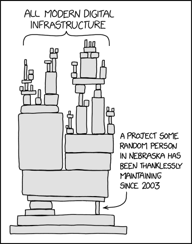

# Contribute to (OSS) Open source software

All of us use OSS; moreover, most of the software we use is based on OSS. A routine process of development is picking packages from platform sources, for example, npm, if you are developing a JavaScript program, and writing some light glue code to make your app work. This is the nature of software development because of one of the base principles, **"DRY" — do not repeat yourself**. Following that principle, developers try to reuse every piece of code that is repeated. 

It has become hard to find these pieces because many developers have already done that work. Also, when a piece of software is done by a developer who really loves their work, it is polished and done with the best efforts. 

With all these things in mind, it becomes really hard to put something valuable in public or contribute to a project that is already used by many developers, even for a person with a few years of development experience (middle or senior developers) or experts from close areas who have never contributed directly. 

Another reason that pushed me in that direction is my colleagues' expertise. In conversations with a good friend of mine, who is HR, and one of the developers who frequently conducts technical interviews, I got some insight regarding how public work may transform the interview process. From their experience, OSS contributions are rare, and they will raise curiosity for sure. You may shift the interview towards your area of expertise and leave a good impression, even if you are inaccurate in your answers in required areas.

While this "stair" is high, such a step may become a very useful experience. It also looks very impressive in a CV because all developers have some kind of pet projects, but usually, they are too shy to put them in public. The purpose of this guide is to help you step on that stair.

---

## Choosing tech and project

From a practical point of view, it is always better to stay with the most popular technology because of the larger community. There will be a large number of edge cases solved, a bigger toolset, and more documentation; it is still humans writing code, so more humans = more code :).

According to [GitHub 2024 Octoverse](https://github.blog/news-insights/octoverse/octoverse-2024/), Python beats JavaScript as the most popular language.

 

> *"There are three kinds of lies: lies, damned lies, and statistics."* — Mark Twain  
> *"TypeScript (TS) is a superset of JavaScript (JS), developed and maintained by Microsoft as an open-source programming language."* — Google  

So, I would not say that JavaScript is beaten by Python. 

According to the logic described above, my choice for OSS contribution will be JavaScript and NodeJs as a platform. My primary area of knowledge is Accessibility tools. I’m also working as a software tester. With this in mind, the best for me would be to contribute to some accessibility tool that is related to testing and written in JavaScript. I know these tools a little, so I will go directly to [axe-core](https://github.com/dequelabs/axe-core). 

You may find this logic too smooth to be true, especially since I’m not showing the research process. It's true that I already knew my target project before I started. However, I still recommend not blindly picking just any project. You need to carefully consider the learning curve; otherwise, it might kill your motivation.

---

## Tools and basics

For sure, you have to learn the basics to become a developer for this project. They are: 
- **Git**: *version control systems*
- **JavaScript**: *programming language*
- **NodeJs**: *JavaScript runtime*
- **Npm**: *JavaScript package manager*
- **VSCode**: *Integrated development environment*

You need to download and install these tools on your PC, following the official guides.

From my experience, the best way to learn something is to actually try using it. Some tools are quite straightforward — you don't need to spend hours figuring out how to chop a stick with an axe. A couple of hours of practice might be enough... maybe just a finger or two lost in the process! ;)

---

### Git

You need Git to commit your changes to the source code. Luckily, you don’t have to fully master it — just understanding the basic principles of version control systems is enough. Long story short, you’ll be editing text files alongside other people, and there are plenty of tools to sync your files in one place. Git is the de facto industry standard for this now. 

---

### VSCode

Editing text in Notepad is deadly simple, but you have to use many other tools to make it smooth. A place where all these tools are aggregated is an integrated development environment. We need VSCode to navigate and search in code; it has nice syntax highlighting and text formatting. Also, we can avoid the Git command line.

---

### JavaScript

You have to understand basics like variables, loops, and functions. By the way, you can use any code generation tools, like ChatGPT or its analogs. Personally, I prefer Co-Pilot.

---

### NPM and NodeJs

While developing software, you need to use other developers’ code. Otherwise, you will write everything from scratch each time you start a project. An easy way is to go to GitHub and copy-paste code from other repositories. But how about the code that other repositories use themselves? 

You need to climb a dependency tree until you reach the very basic runtime platform code. There are tools for code sharing that are usually specific to a platform or language. In our case, it is NPM (Node Package Manager), the default package manager that comes bundled with NodeJs. 

Each package manager comes with some hidden costs. For example, where is the guarantee that, somewhere deep in the dependency graph, there isn’t a package that contains malicious code? This is called a supply chain attack.


---

## Discover Chosen Project

First of all, you need a GitHub account; these days, it’s like Facebook for developers. I already have one: [https://github.com/engineerklimov](https://github.com/engineerklimov). I will create a copy of [axe-core](https://github.com/dequelabs/axe-core); in Git terms, this is called a fork.

Let’s download the source code from my axe-core fork and try some basic operations. As I explained before, you don’t need to know all Git commands to use it; probably, you can even avoid its shell. Open VSCode and navigate as shown in the picture. In the text field, choose "Clone from GitHub" or copy-paste the repository URL.

 

---

### Restore Packages and Build the Project

The next step, after you have the axe-core code locally, is restoring NPM packages. Installed packages and basic commands for the project in NodeJs are usually specified in `package.json`. 

As I explained before, a big dependency tree is a big bag to carry. I also mentioned that open-source is “best effort” software, so axe-core developers reduced their production dependencies to 0. If you look at the manifest, there are only `devDependencies`. External code that goes with your JavaScript app is located in `dependencies`, which is missing here. That means maintainers implemented all functions down to browser code to make the axe-core library tiny. 


Let’s try to build it. In VSCode, open the project folder and open the terminal if it’s not open yet. Execute the following commands:

1. Restore dependencies:
   ```bash
   npm install
   ```

2. Build the project:
   ```bash
   npm run build
   ```

After `npm install`, you should see the following output:


A valid `npm run build` output:


---

## Find Contribution Target

Where to look for opportunities? There are three main sources: 

---

### Repository Issues

This is a worklog for the project; it also contains reported bugs and other tasks. Issues are usually marked with labels. It’s better to check the entire [list](https://github.com/dequelabs/axe-core/labels). I found `good first issue` and `help wanted` labels that might fit my purposes. 

There are a few in each label. I quickly checked them and found one that is pretty well described. I had no idea what needed to be done technically, but at least I understood the requirements. Maintainers pointed to files where these changes needed to be done, which is already part of the technical work since I had no idea about the project structure. 

I decided to spend more time and look for something completely simple to contribute, just to try.

---

### Past Contributions from Non-Maintainers

Another place to look is [closed pull requests](https://github.com/dequelabs/axe-core/pulls?q=is%3Apr+is%3Aclosed). You need to filter out work done by main project developers, as it might be too complex to follow. 

I checked the first three pages and found a closed pull request that is very promising for me: [chore: Update locale de.json](https://github.com/dequelabs/axe-core/pull/4525). It’s a localization improvement for error messages. 

Usually, localizations are static resources for applications that contain collections of message templates. These templates are used in code to show messages in different languages. This is a serial change, so I can look at any existing localization and repeat it. 

I also found good instructions in the repository document [readme.md](https://github.com/dequelabs/axe-core?tab=readme-ov-file#localization). So, that will be my task: "Add ru locale."

---

## Prepare Pull Request

Let’s add a new locale for axe-core. The first step is to make our own repository version. There are two ways:

1. You can make a branch in the main repository. Click on the left bottom corner on the current branch name `develop`, choose **"Create new branch..."**, click, and type the branch name. It’s better to not use special characters in branch names.
2. There might be policies on branch names, or new branches may be restricted for everyone. In such a case, you can create a fork from the main repository, make your changes, and create a pull request from the fork to the main repo. 


---

### Add Changes

The change itself is not complex. I followed instructions in the repository root and called:
```bash
npx grunt translate --lang=ru
```

After that, the `ru.json` file appeared in the `locales` folder. All English text needed to be translated to Russian. That work might be time-consuming due to the amount of text. In my case, it was approximately 1,000 lines. 

I used automated translation tools and reviewed it manually since the target language is my native one. 

After the work is done, you need to commit locally and publish your changes to the GitHub repository. You can do it with just a few button clicks in the **Source Control** tab. 

---

### Submit Pull Request

Once the branch is on the remote repository, you can create a pull request. This is a request to repository maintainers to include (merge) your changes into the main branch. Once changes are merged, sooner or later, they will be published with a new application version and downloaded by developers across the world. 

You need to look at naming conventions for such requests and add a meaningful description.


---

## Maintainers' Review and Merge

Preparing a pull request is only half of the work, and this half is the most enjoyable. The review process can be a painful thing; sometimes it is slow and full of hard discussions. Luckily, my change was not technical, so I thought it would be easy. :)

After a few days of waiting, I checked how long it took to review previous localization requests. I found a few changes done pretty quickly, but another localization was stuck for half a year. 

I decided to wait a few more days and start softly pushing the review process. You have to be creative and gentle, especially if you are contributing for the first time to a project, much like when you enter and meet a new group of people who know each other but not you. 

---

### My Approach

I went two ways:
- I asked my colleagues to like my PR (pull request). You may see in the picture above that I collected 20!
- On the GitHub profile of one of the most active developers, I found their email and wrote a message about myself and my motivation to contribute to my work toolset.

After that, I got a comment from that developer. They requested a small change, and I immediately did it. During the review, you should not blindly accept other developers’ change suggestions. Instead, try to explain and defend your implementation with arguments. All developers may make mistakes, even the most experienced ones. 

Also, you have to understand the context. In my case, I’m a guest in that project. 

The review went fine, and the last bit was tests and automatic checks. Somehow, a few pipelines were failing on my branch. I’m not sure why because I had not touched the code. It may be the case that these pipelines are flaky or they were broken by someone else at the point when I forked the repository. 

I will never know because, right after approval, a developer from the maintainers’ team merged it. A month later, it was taken into release. 

---

## Bonus

When I was testing the translation command:
```bash
npx grunt translate --lang=ru
```

I found that many of the other locales are outdated. This is a constant problem for every text in the code that is not checked by a compiler. Maintainers also have limited resources, so you can easily repeat my steps for any locale, and there will be messages that are outdated. 

That may look like a very small contribution, but look at the scale of axe-core. It is downloaded 16,000,000 times weekly, according to NPM stats. So, even with such little effort, you can make the world better.
